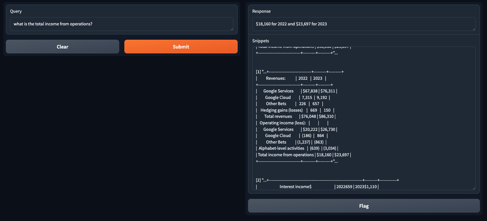
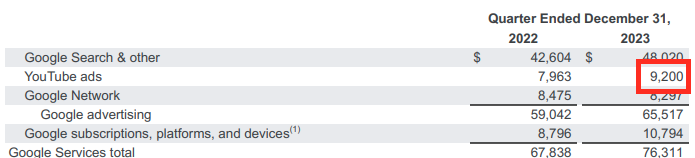

# Introduction




A customizable GenAI RAG application using Google Cloud components:
- Gemini: LLM
- textembedding-gecko: embedding model
- Cloud Run: app deployment
- DocAI: document parsing  

The app also uses the following open source components:
- gradio: UI 
- langchain: orchestration of RAG components

The project has quick customizable options in [src/config.py](https://github.com/felipecastrillon/GenAIRagApp/blob/main/src/config.py):
- Text split chunk size
- Text split chunk overlap
- Use your own DocAI parser
- Include "text" vs "table + text" parsing 

Roadmap:
- [x] Add retrieval snippets to UI 
- [ ] fix: remove wrongly parsed tables from text parser, let form parser handle it. 
- [ ] Read directory instead of one file
- [ ] Read files from GCS 
- [ ] Include Vertex Search as a retrieval source
- [ ] Include Vertex Vector Search as a retrieval source
- [ ] Filtered retrieval based on document metadata (year, customer, etc...)
- [ ] Evaluation job of RAG model for accuracy
- [ ] Add github actions

# Requirements
Google Cloud Platform (GCP) project
python version  >= 3.8

# Setup

## Google Cloud Project Setup

Enable the following APIs
- Cloud Document AI API
- Vertex AI API
- Cloud Run API
- Generative Language API

[Create Service Account](https://cloud.google.com/iam/docs/service-accounts-create) with following roles: 
- Vertex AI Administrator
- Document AI API User
- Cloud Run Developer

[Create a service account key](https://cloud.google.com/iam/docs/keys-create-delete#creating) which automatically downloads a json file with your key:

Next, edit src/config.py to include your GCP project:
```
PROJECT = <PROJECT_ID> 
```

## Setup Documents and Parser

Add the pdf document that you are trying to ask questions from to the "docs/" directory and modify src/config.py:
```
FILENAME=<DOCUMENT_LOCATION>
``` 

[Create a DocAI processor](https://cloud.google.com/document-ai/docs/create-processor) and modify src/config.py:

```
PROCESSOR_ID=<PROCESSOR_ID>
PROCESSOR_VERSION=<PROCESSOR_VERSION>
```

## Running the App Locally or in Cloud Run

### Option: Runing Locally

Find the location of the json service account file that was downloaded and run on terminal:
```
export GOOGLE_APPLICATION_CREDENTIALS = <SERVICE ACCOUNT FILE LOCATION>
```

Clone this terminal and run:
```
cd src
python main.py
```

### Option: Running in Cloud Run

Modify Dockerfile to include your own project:
```
ENV GOOGLE_CLOUD_PROJECT <PROJECT_ID> 
```

Deploy to cloud run:
```
gcloud run deploy <ANY APP NAME> --source . --region <REGION> --service-account=<SERVICE_ACCOUNT>
```


